# GraphRAG-rs Architecture

This document provides a comprehensive technical overview of the GraphRAG-rs system architecture.

## System Overview

GraphRAG-rs is a high-performance, modular Retrieval-Augmented Generation (RAG) system built in Rust that transforms documents into queryable knowledge graphs with advanced retrieval capabilities:


## Core Components

### 1. Text Processing Layer

Handles document ingestion, cleaning, and intelligent chunking:

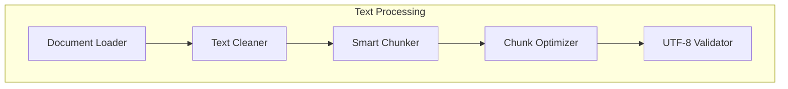

**Key Modules:**
- `src/text/` - Advanced text processing and chunking
- `src/core/` - Document structures and interfaces
- `src/corpus/` - Document collection management

**Features:**
- Hierarchical chunking with configurable overlap
- UTF-8 safe boundary detection
- Semantic-aware chunk boundaries
- Document metadata preservation
- Multi-format support (text, markdown, JSON)

### 2. Entity Extraction Layer

Advanced entity identification and extraction with multiple strategies:

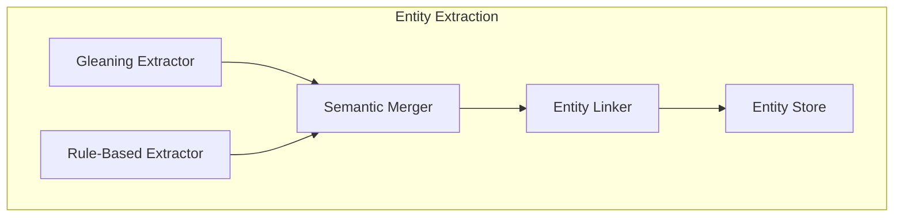

**Key Modules:**
- `src/entity/` - Core entity extraction
- `src/entity/gleaning_extractor.rs` - Iterative entity refinement
- `src/entity/semantic_merging.rs` - Semantic entity resolution
- `src/corpus/entity_linker.rs` - Cross-document entity linking

**Features:**
- Gleaning extraction with iterative refinement
- Semantic entity merging and deduplication
- Automatic entity linking across documents
- Co-occurrence analysis
- Entity type classification
- Fuzzy matching with configurable thresholds

### 3. Knowledge Graph Layer

Sophisticated graph construction with community detection:

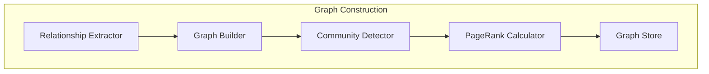

**Key Modules:**
- `src/graph/` - Graph construction and operations
- `src/graph/pagerank.rs` - PageRank implementation
- `src/corpus/knowledge_graph.rs` - Knowledge graph management
- `src/rograg/` - Read-Optimized Graph RAG implementation

**Features:**
- Semantic relationship discovery
- Hierarchical community detection
- PageRank for node importance
- Graph summarization
- Subgraph extraction
- Graph-based reasoning

### 4. Vector Index Layer

Multi-modal embedding generation and indexing:

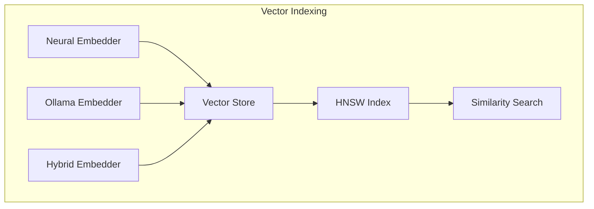

**Key Modules:**
- `src/vector/` - Vector operations and indexing
- `src/embeddings/` - Multiple embedding strategies
- `src/embeddings/neural/` - Neural network embeddings
- `src/embeddings/hybrid.rs` - Hybrid embedding approaches
- `src/ollama/embeddings.rs` - Ollama integration

**Features:**
- Multiple embedding models (Neural, Ollama, OpenAI)
- HNSW for fast similarity search
- Hybrid embeddings (dense + sparse)
- Embedding caching
- Batch processing
- Dynamic dimensionality

### 5. Retrieval Layer

Advanced multi-strategy retrieval system:

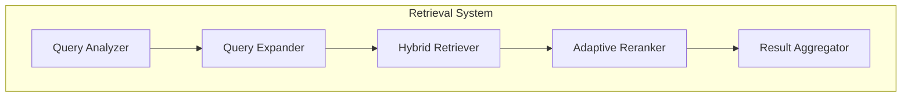

**Key Modules:**
- `src/query/` - Query processing and orchestration
- `src/retrieval/` - Multiple retrieval strategies
- `src/retrieval/hybrid.rs` - Hybrid search
- `src/retrieval/adaptive.rs` - Adaptive retrieval
- `src/reranking/` - Advanced reranking strategies

**Features:**
- Query expansion with synonyms
- Hybrid retrieval (semantic + keyword + graph)
- Adaptive strategy selection
- Multi-stage reranking
- PageRank-based relevance scoring
- Context window optimization

### 6. Generation Layer

Intelligent answer generation with multiple LLM backends:

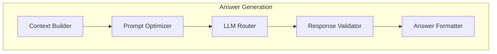

**Key Modules:**
- `src/generation/` - Answer generation orchestration
- `src/ollama/` - Ollama LLM integration
- `src/function_calling/` - Function calling capabilities
- `src/summarization/` - Text summarization

**Features:**
- Multi-LLM support (Ollama, OpenAI, Claude)
- Context-aware generation
- Function calling for structured outputs
- Response validation and filtering
- Streaming responses
- Answer caching

### 7. Caching Layer

Comprehensive multi-level caching system:

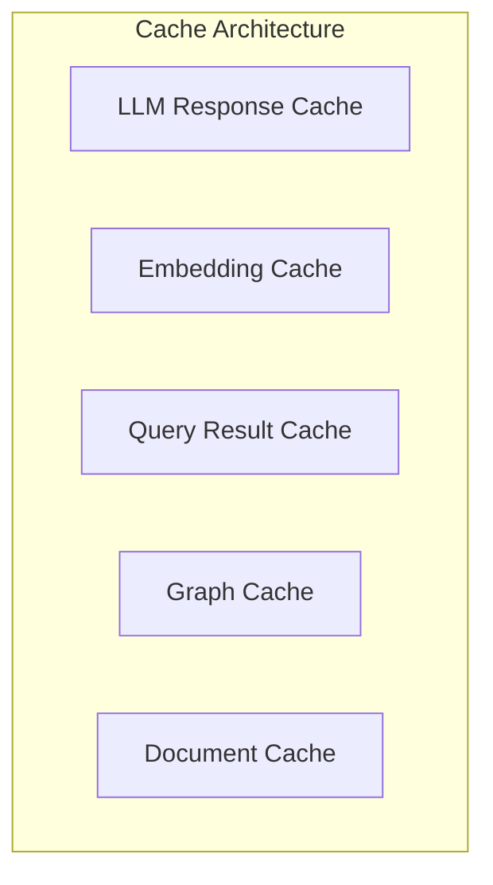

**Key Modules:**
- `src/caching/` - Core caching infrastructure
- `src/embeddings/neural/cache.rs` - Embedding-specific cache

**Features:**
- LRU eviction policy
- Content-based cache keys
- TTL support
- Memory-mapped caching
- Cache warming strategies
- Cache statistics

### 8. Async Processing Layer

High-performance asynchronous processing pipeline:

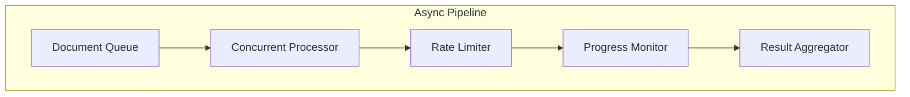

**Key Modules:**
- `src/async_processing/` - Async pipeline orchestration
- `src/async_processing/concurrent_pipeline.rs` - Concurrent processing
- `src/async_processing/rate_limiting.rs` - Rate limiting
- `src/async_processing/monitoring.rs` - Progress monitoring
- `src/parallel/` - Parallel processing utilities

**Features:**
- Concurrent document processing
- Configurable rate limiting
- Real-time progress monitoring
- Error recovery and retry logic
- Resource pooling
- Backpressure handling

### 9. Storage Layer

Flexible storage abstraction with multiple backends:

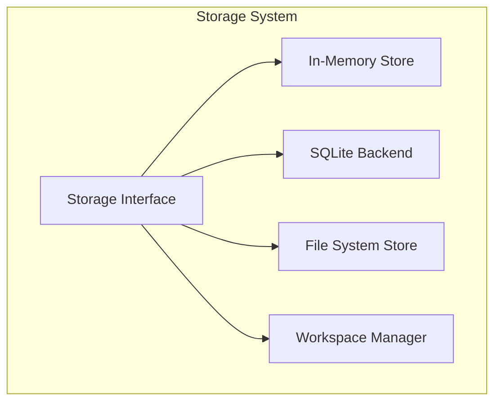

**Key Modules:**
- `src/storage/` - Storage abstraction and implementations
- `src/storage/workspace.rs` - Workspace management
- `src/phase_saver.rs` - Incremental save points

**Features:**
- Pluggable storage backends
- Transaction support
- Workspace isolation
- Incremental saves
- Data compression
- Migration support

### 10. Monitoring & Observability

Comprehensive monitoring and metrics collection:

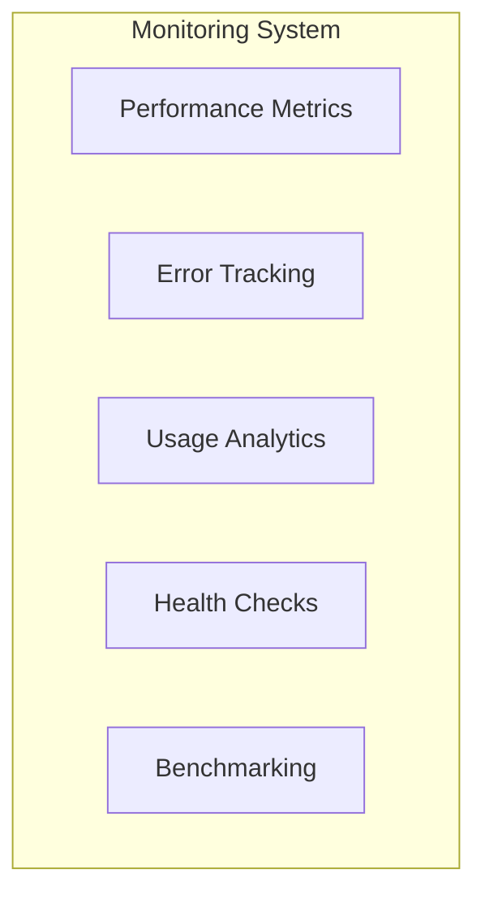

**Key Modules:**
- `src/monitoring/` - Core monitoring infrastructure
- `src/monitoring/metrics.rs` - Metrics collection
- `src/monitoring/benchmark.rs` - Performance benchmarking

**Features:**
- Real-time performance metrics
- Error aggregation and reporting
- Resource usage tracking
- Latency percentiles
- Custom metric definitions
- Export to Prometheus/Grafana

## Data Flow

### Document Processing Pipeline

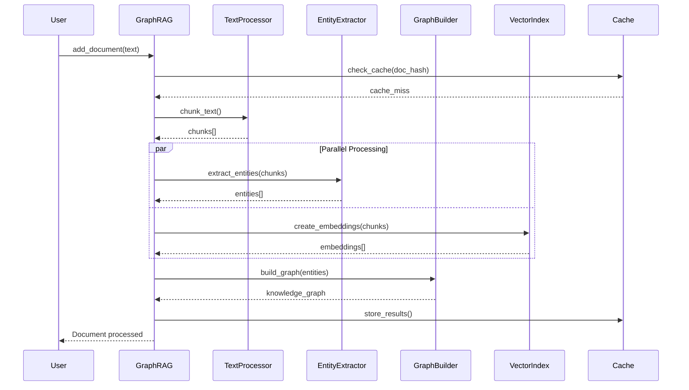

### Query Processing Pipeline

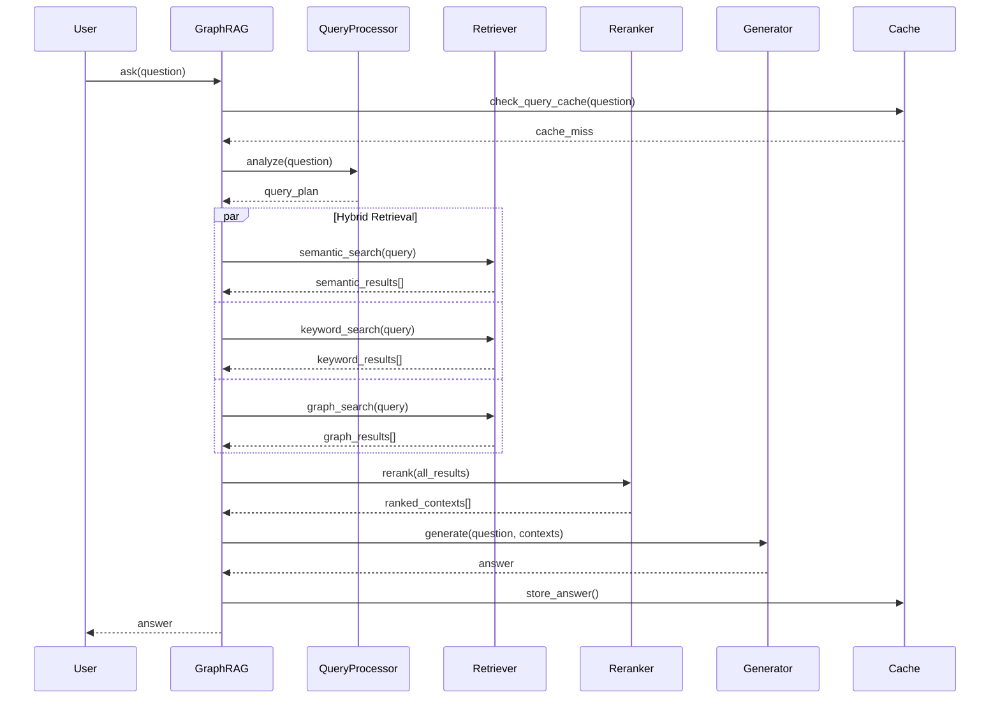

## Module Architecture

### Updated Module Structure

```
src/
├── api/                # REST API interfaces
│   └── mod.rs         # API endpoints and handlers
├── async_processing/   # Async processing pipeline
│   ├── mod.rs         # Pipeline orchestration
│   ├── concurrent_pipeline.rs
│   ├── monitoring.rs  # Progress tracking
│   └── rate_limiting.rs
├── builder.rs         # GraphRAG builder pattern
├── caching/           # Caching infrastructure
│   └── mod.rs         # Cache implementations
├── config/            # Configuration management
│   └── mod.rs         # Config parsing and validation
├── core/              # Core types and traits
│   └── mod.rs         # Document, Entity, Chunk types
├── corpus/            # Document collection management
│   ├── mod.rs         # Collection operations
│   ├── document_manager.rs
│   ├── collection_processor.rs
│   ├── entity_linker.rs
│   └── knowledge_graph.rs
├── embeddings/        # Embedding generation
│   ├── mod.rs         # Embedding interface
│   ├── hybrid.rs      # Hybrid embeddings
│   └── neural/        # Neural embeddings
│       ├── mod.rs
│       ├── transformer.rs
│       ├── tokenizer.rs
│       ├── cache.rs
│       └── models.rs
├── entity/            # Entity extraction
│   ├── mod.rs         # Core extraction
│   ├── gleaning_extractor.rs
│   └── semantic_merging.rs
├── function_calling/  # Function calling support
│   └── mod.rs         # Function interfaces
├── generation/        # Answer generation
│   ├── mod.rs         # Generation orchestration
│   └── async_mock_llm.rs
├── graph/             # Graph operations
│   ├── mod.rs         # Graph construction
│   └── pagerank.rs    # PageRank algorithm
├── lightrag/          # LightRAG implementation
│   └── mod.rs         # Lightweight RAG
├── monitoring/        # Monitoring & metrics
│   ├── mod.rs         # Core monitoring
│   ├── metrics.rs     # Metric collection
│   └── benchmark.rs   # Performance benchmarks
├── ollama/            # Ollama integration
│   ├── mod.rs         # Client interface
│   ├── embeddings.rs  # Embedding generation
│   └── config.rs      # Ollama configuration
├── parallel/          # Parallel processing
│   └── mod.rs         # Parallel utilities
├── phase_saver.rs     # Incremental saving
├── query/             # Query processing
│   └── mod.rs         # Query orchestration
├── reranking/         # Result reranking
│   └── mod.rs         # Reranking strategies
├── retrieval/         # Retrieval strategies
│   ├── mod.rs         # Base retrieval
│   ├── hybrid.rs      # Hybrid search
│   └── adaptive.rs    # Adaptive strategies
├── rograg/            # Read-Optimized GraphRAG
│   └── mod.rs         # ROGRAG implementation
├── storage/           # Storage abstraction
│   ├── mod.rs         # Storage interface
│   ├── workspace.rs   # Workspace management
│   └── tests.rs       # Storage tests
├── summarization/     # Text summarization
│   └── mod.rs         # Summarization strategies
├── text/              # Text processing
│   └── mod.rs         # Chunking and cleaning
└── vector/            # Vector operations
    └── mod.rs         # Vector indexing
```

## Configuration System

### TOML Configuration

Comprehensive configuration with sensible defaults:

```toml
[general]
output_dir = "./output"
log_level = "info"
max_workers = 8

[pipeline]
chunk_size = 800
chunk_overlap = 200
batch_size = 32
enable_caching = true

[models]
embedding_model = "nomic-embed-text"
chat_model = "llama3.1:8b"
embedding_dim = 768
context_window = 4096

[retrieval]
strategy = "hybrid"  # hybrid, semantic, keyword, adaptive
top_k = 5
rerank_top_k = 3
similarity_threshold = 0.7

[graph]
enable_communities = true
pagerank_damping = 0.85
min_community_size = 3

[caching]
cache_size_mb = 512
ttl_seconds = 3600
enable_embedding_cache = true
enable_llm_cache = true

[async_processing]
max_concurrent = 10
rate_limit_rps = 50
timeout_seconds = 30
retry_attempts = 3

[monitoring]
enable_metrics = true
metrics_port = 9090
export_format = "prometheus"
```

### Builder Pattern API

Modern, fluent API for configuration:

```rust
use graphrag_rs::{GraphRAG, ConfigPreset};

// Simple setup with presets
let graphrag = GraphRAG::builder()
    .from_preset(ConfigPreset::Fast)
    .with_ollama()
    .build()?;

// Advanced configuration
let graphrag = GraphRAG::builder()
    .with_text_config(1000, 200)  // chunk_size, overlap
    .with_retrieval_config(10, 5)  // search_top_k, rerank_top_k
    .with_graph_config(true, 0.85) // enable_communities, pagerank_damping
    .with_async_config(16, 100)    // max_concurrent, rate_limit
    .with_caching()                 // Enable all caching
    .with_monitoring()              // Enable monitoring
    .build()?;

// With custom components
let graphrag = GraphRAG::builder()
    .with_storage(CustomStorage::new())
    .with_embedder(CustomEmbedder::new())
    .with_llm(CustomLLM::new())
    .build()?;
```

## Performance Optimizations

### Parallel Processing Architecture

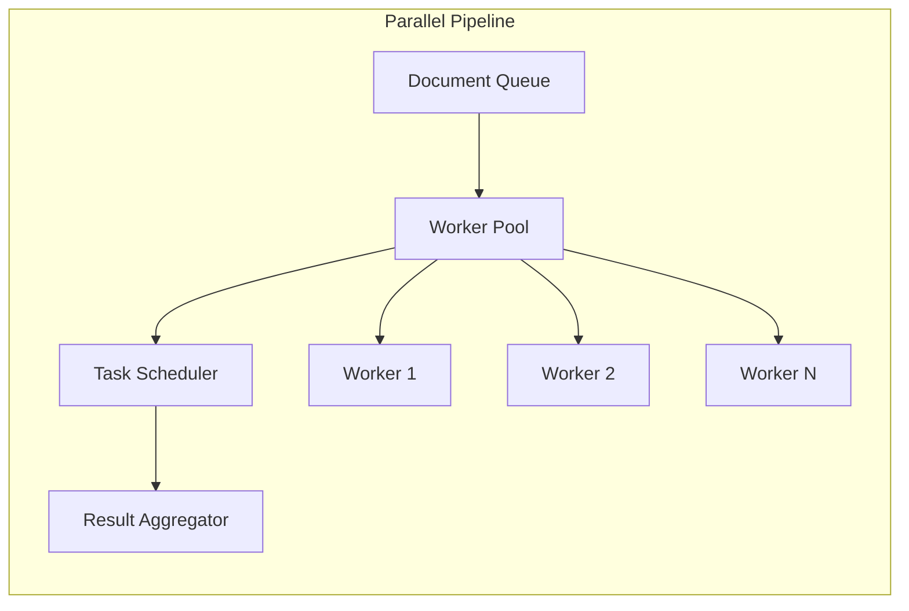

**Implementation:**
- Rayon for data parallelism
- Tokio for async I/O
- Work-stealing scheduler
- Dynamic thread pool sizing
- CPU affinity optimization

### Memory Management

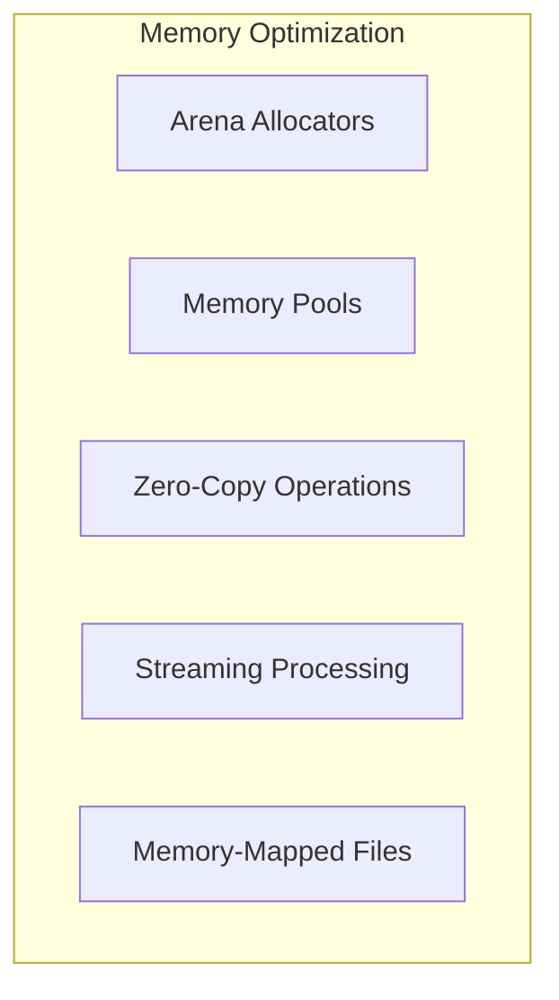

**Strategies:**
- Arena allocation for temporary objects
- Object pooling for reusable components
- Zero-copy string operations
- Streaming for large documents
- Memory-mapped I/O for large graphs

## Deployment Architectures

### Development Setup

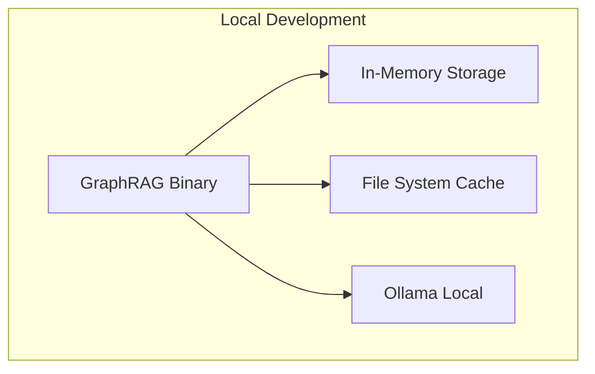

### Production Deployment

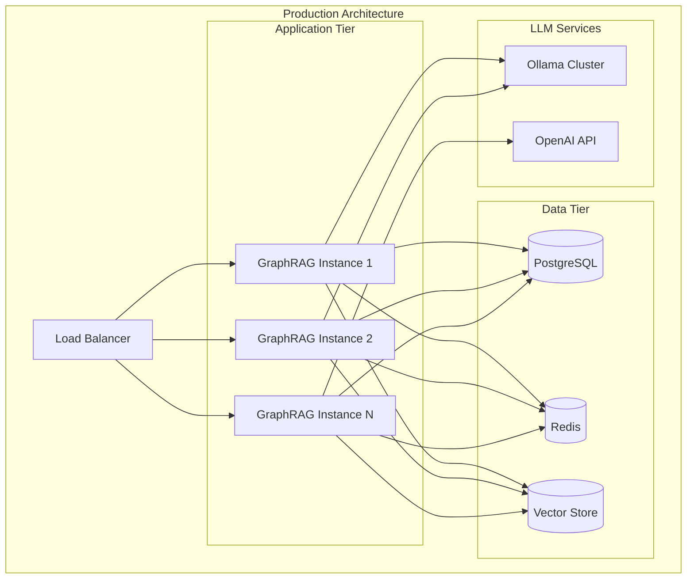

## Advanced Features

### 1. Incremental Updates

Support for incremental document updates without full reprocessing:

```rust
// Add new documents to existing graph
graphrag.add_document_incremental(new_doc)?;

// Update existing entities
graphrag.update_entity(entity_id, new_data)?;

// Remove outdated information
graphrag.remove_document(doc_id)?;
```

### 2. Multi-Modal Support

Process various content types:

```rust
// Text documents
graphrag.add_document_from_text(text)?;

// JSON structured data
graphrag.add_document_from_json(json)?;

// Markdown with metadata
graphrag.add_document_from_markdown(markdown)?;

// URL content
graphrag.add_document_from_url(url).await?;
```

### 3. Advanced Query Types

Support for complex query patterns:

```rust
// Simple question
let answer = graphrag.ask("What is X?")?;

// Multi-hop reasoning
let answer = graphrag.ask_with_reasoning("How does X relate to Y?")?;

// Structured extraction
let data = graphrag.extract_structured::<MyStruct>("Extract data about X")?;

// Graph queries
let subgraph = graphrag.query_graph("MATCH (n)-[r]-(m) WHERE n.type = 'X'")?;
```

### 4. Function Calling

Structured output generation with function calling:

```rust
#[derive(FunctionSchema)]
struct WeatherQuery {
    location: String,
    date: Option<String>,
}

let result = graphrag.call_function::<WeatherQuery>(
    "What's the weather in Tokyo tomorrow?"
)?;
```

## Security & Privacy

### Security Layers

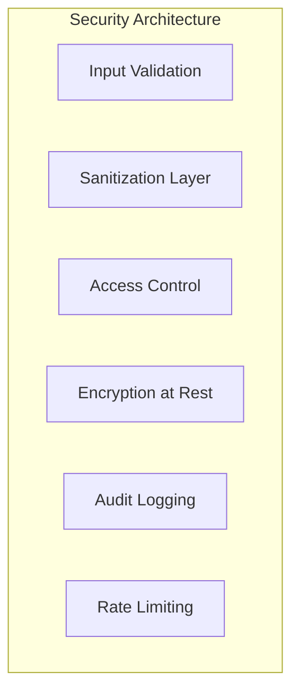

**Implementations:**
- Input sanitization for all text
- SQL injection prevention
- XSS protection
- API key management
- Role-based access control
- End-to-end encryption option
- Comprehensive audit trails
- PII detection and masking

## Monitoring & Observability

### Metrics Dashboard

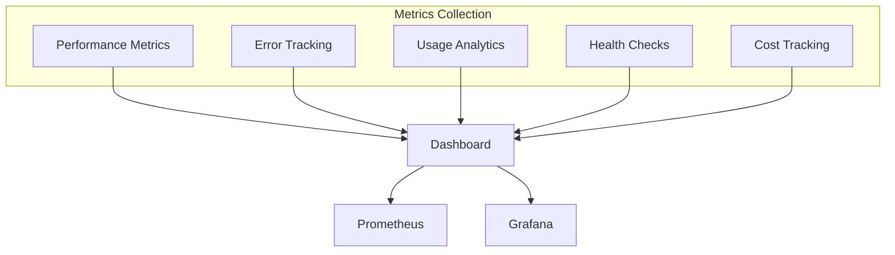

**Available Metrics:**
- Document processing throughput
- Query latency (p50, p95, p99)
- Cache hit rates by type
- Memory usage patterns
- CPU utilization
- Error rates by component
- Token usage and costs
- Active connections
- Queue depths

## Best Practices

### 1. Optimal Configuration

```rust
// For large documents
GraphRAG::builder()
    .with_text_config(1500, 300)  // Larger chunks
    .with_async_config(32, 100)   // More parallelism
    .build()?

// For real-time applications
GraphRAG::builder()
    .from_preset(ConfigPreset::Fast)
    .with_caching()
    .with_retrieval_config(3, 1)  // Fewer results
    .build()?

// For accuracy-critical use cases
GraphRAG::builder()
    .from_preset(ConfigPreset::Accurate)
    .with_retrieval_config(20, 10)  // More candidates
    .with_reranking()
    .build()?
```

### 2. Error Handling

```rust
use graphrag_rs::{GraphRAG, GraphRAGError};

match graphrag.ask(question) {
    Ok(answer) => println!("{}", answer),
    Err(GraphRAGError::RateLimited) => {
        // Implement backoff
    },
    Err(GraphRAGError::Timeout) => {
        // Retry with increased timeout
    },
    Err(e) => {
        // Log and handle other errors
    }
}
```

### 3. Resource Management

```rust
// Use resource pools
let graphrag = GraphRAG::builder()
    .with_connection_pool(10)
    .with_embedding_batch_size(32)
    .build()?;

// Clean up resources
graphrag.clear_cache()?;
graphrag.compact_storage()?;
```

## Roadmap

### Current Focus
- ✅ Async processing pipeline
- ✅ Advanced entity extraction
- ✅ Hybrid retrieval strategies
- ✅ Multi-LLM support
- ✅ Comprehensive caching
- 🚧 Distributed processing
- 🚧 GraphQL API

### Future Enhancements
- [ ] Distributed graph storage
- [ ] Federated learning support
- [ ] Multi-language support
- [ ] Real-time graph updates
- [ ] Custom plugin system
- [ ] AutoML for parameter tuning
- [ ] Graph visualization tools

## FAQ

**Q: How does GraphRAG-rs handle large documents?**
A: Documents are processed in configurable chunks with parallel processing. The async pipeline ensures efficient resource usage and the caching layer prevents redundant processing.

**Q: Can I use custom embedding models?**
A: Yes, implement the `Embedder` trait and register it with the builder. The system supports multiple embedding strategies including neural, Ollama, and hybrid approaches.

**Q: How is the graph stored?**
A: The graph uses a flexible storage abstraction with support for in-memory, SQLite, PostgreSQL, and custom backends. Graphs can be persisted and loaded incrementally.

**Q: What makes retrieval "hybrid"?**
A: Hybrid retrieval combines semantic search (vector similarity), keyword search (BM25), and graph-based retrieval (PageRank, community detection) with adaptive weighting based on query characteristics.

**Q: How does caching improve performance?**
A: Multi-level caching (LLM responses, embeddings, query results, graph computations) reduces redundant processing. Cache keys are content-based with configurable TTL and LRU eviction.

**Q: Can GraphRAG-rs scale horizontally?**
A: Yes, the stateless architecture supports horizontal scaling with shared storage backends. Load balancing and distributed caching enable multi-instance deployments.

---

For implementation details and API documentation, see:
- [API Documentation](https://docs.rs/graphrag-rs)
- [Examples](./examples/)
- [Configuration Guide](./CONFIGURATION_GUIDE.md)